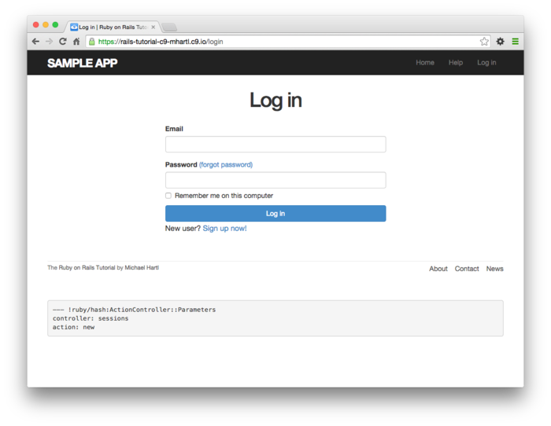
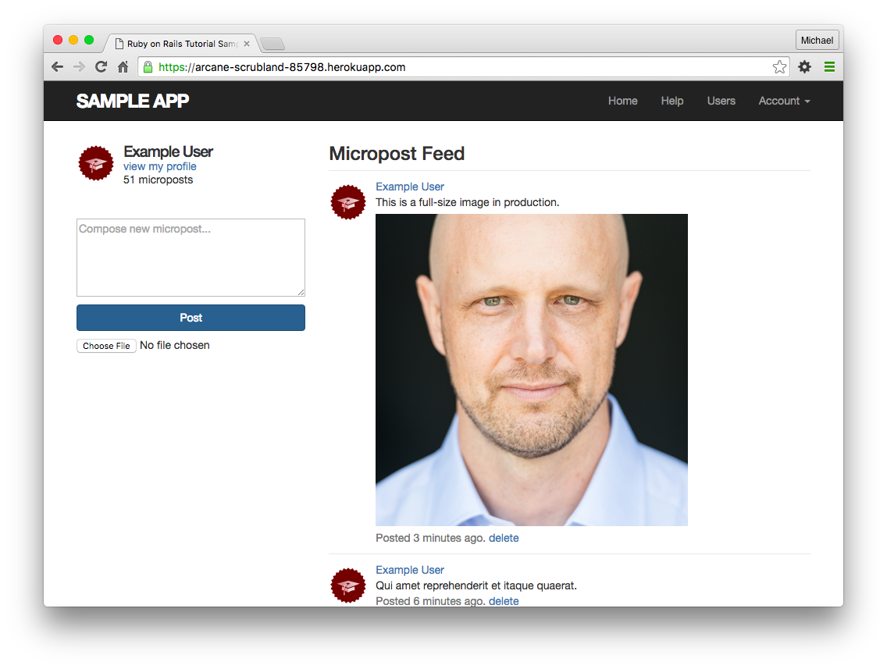

# Some-what Twitter: Full-stcak rails application
- Secure (some-what) twitter clone, build with complete Test Driven Development (TDD). 
- Version Used:
    - ruby  2.3.3
    - rails 5.1.6

1. Clone this repo.
1. Run commands as follow:
    ```
    $ rails test
    $ rails db:migrate
    $ rails db:seed
    $ rails server
    ```

## Application Screenshots:

- Login Screen:



- Home Screen:

